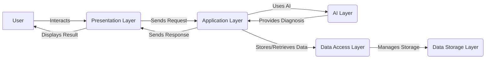

# AI-Powered Diagnostic Software Suite for CSCs
[](https://www.yourwebsite.com)


## 💡 Problem Statement
Underutilized Common Service Centers (CSCs) and a lack of accessible and affordable diagnostic tools create barriers to healthcare access in rural India.

## 💡 Our Solution
We propose an AI-powered diagnostic software suite that transforms existing CSC computers into health diagnostic and information kiosks, providing essential healthcare services to rural populations.

## 📊 Architecture


### Key Components:

<details>
  <summary>Click to expand!</summary>

  #### 1. Presentation Layer (UI)
  - **Purpose**: Provides the user interface for interaction with the system.
  - **Technology**: 
    - Web-based interface (HTML, CSS, JavaScript) for cross-platform compatibility.
    - Framework: React, Angular, or Vue.js for building a responsive and interactive UI.
  - **Key Components**:
    - Login/Authentication Module
    - Symptom Input Forms (with multilingual support)
    - AI Diagnostic Results Display
    - Teleconsultation Portal
    - Health Information Library
    - Data Analytics Dashboard

  #### 2. Application Layer (Business Logic)
  - **Purpose**: Implements the core business logic of the system, including user authentication, data validation, AI processing, and report generation.
  - **Technology**: 
    - Programming Language: Python (with frameworks like Flask or Django)
    - API Framework: RESTful APIs for communication between the UI and backend services.
  - **Key Components**:
    - User Management Service
    - Symptom Processing Service
    - AI Diagnostic Service (integrates with the AI model)
    - Teleconsultation Service (integrates with WebRTC or Jitsi Meet)
    - Data Analytics Service

  #### 3. AI Layer
  - **Purpose**: Hosts the AI model for diagnostic assistance.
  - **Technology**: 
    - AI Framework: TensorFlow Lite or PyTorch Mobile (for efficient on-device AI processing).
  - **Key Components**:
    - Pre-trained AI Model (for common rural ailments)
    - Model Inference Engine
    - Data Preprocessing Module
    - Model Update Mechanism (for continuous learning and improvement)

  #### 4. Data Access Layer
  - **Purpose**: Provides access to the data storage layer.
  - **Technology**: 
    - Database: SQLite (encrypted) for local data storage.
    - ORM (Object-Relational Mapping): SQLAlchemy or Django ORM for simplified database interactions.
  - **Key Components**:
    - Data Access Objects (DAOs) for each data entity (users, patients, symptoms, diagnoses, etc.)

  #### 5. Data Storage Layer
  - **Purpose**: Stores all data related to the system, including user information, patient records, symptoms, diagnoses, and health information.
  - **Technology**: 
    - SQLite (encrypted) for local data storage.
  - **Key Considerations**:
    - Data privacy and security (HIPAA Compliance).
    - Data backup and recovery.
    - Scalability (consider cloud storage for future expansion).

  #### 6. Infrastructure Layer
  - **Purpose**: Integrates with Ayushman Bharat Digital Mission (ABDM).
  - **Technology**: 
    - API Integrations with the necessary ABDM frameworks.

</details>

## 🛠️ Technology Stack
- **Frontend**: React, Tailwind CSS
- **Backend**: Flask, SQLAlchemy
- **AI**: TensorFlow
- **Database**: SQLite
- **Deployment**: Docker (if applicable)

## 🚦 Getting Started
Follow these instructions to set up the project locally.

### Prerequisites
- Python 3.x
- Node.js
- npm

## 🚀 Installation & Setup
1. **Clone the Repository**:
   ```bash
   git clone https://github.com/your-username/your-project-name.git
   cd your-project-name
   ```

2. **Install Python Dependencies**:
   ```bash
   pip install -r requirements.txt
   ```

3. **Install React Dependencies**:
   ```bash
   npm install
   ```

4. **Run the Application**:
   - Start the backend:
     ```bash
     python main.py
     ```
   - Start the frontend:
     ```bash
     npm run dev
     ```

5. **Access the Application**: Open your browser and navigate to `http://localhost:3000`.

## 📱 Features & Screenshots
- **User Authentication**: Secure login for users and CSC operators.
- **AI-Powered Diagnostics**: Provides diagnostic assistance based on user input.
- **Teleconsultation Portal**: Connects users with healthcare professionals.
- **Multilingual Support**: Available in multiple Indian languages.
- **Data Analytics Dashboard**: Tracks usage and health trends.


## 🔒 Security Features
- **Data Encryption**: All sensitive data is encrypted.
- **JWT Authentication**: Secure user authentication using JSON Web Tokens.
- **Compliance**: Adheres to HIPAA guidelines for data privacy.

## 🎯 Future Scope
- **Mobile Application**: Develop a mobile version for wider accessibility.
- **Integration with Government Health Programs**: Collaborate with initiatives like Ayushman Bharat.
- **Advanced AI Features**: Implement more sophisticated AI models for better diagnostics.

## 👥 Team Details
| Team Member | Role | Profile Link |
| --- | --- | --- |
| Team Member 1 | Role | [Profile Link](https://example.com/team-member-1) |
| Team Member 2 | Role | [Profile Link](https://example.com/team-member-2) |
| Team Member 3 | Role | [Profile Link](https://example.com/team-member-3) |


## 🙏 Acknowledgments
- Special thanks to [Mentors/Organizations] for their guidance and support.
- TensorFlow for AI-Powered Diagnostics
- React for Frontend Development
- Flask for Backend Development
- JWT for Authentication

---

### Placeholder for Contact Information


